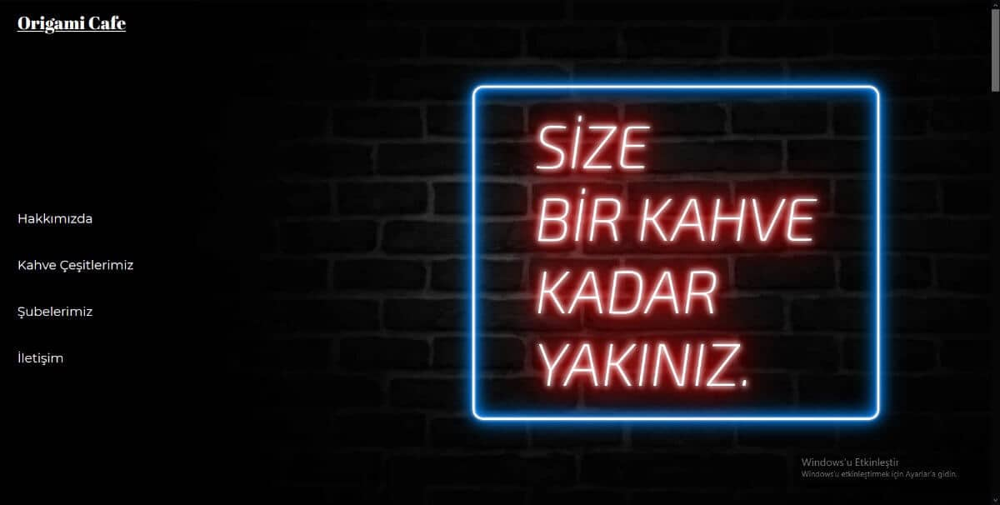
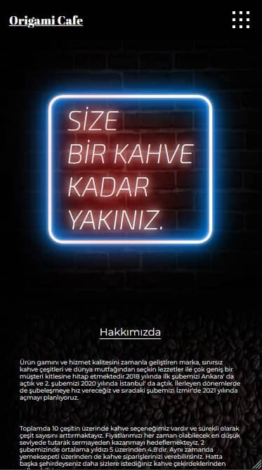

# Origami-Cafe-Website

*Proje HTML/CSS ve JavaScript kullanılarak yapılmıştır.

*Tasarım tamamen responsive' dir.

*Sitede bulunan animasyonlar için AOS(Animate On Scroll) kütüphanesi kullanılmıştır.

*Sitenin yüklenme hızını arttırmak amacıyla bütün resimler olabildiğince küçültülmüştür ve sitede yer alan youtube videoları kullanıcı tıklayana kadar yüklenmemektedir.

*Sitenin mobil cihazlarda yüklenme süresini azaltmak amacıyla srcset yapısı kullanılmış ve AOS kütüphanesi iptal edilmiştir.

*Proje' yi indirmek için sağ üstte bulunan Code yazısına tıkladıktan sonra, Download ZIP diyebilirsiniz, indirdikten sonra index.html dosyasını açarak siteyi görebilirsiniz veya direk bu siteyi ziyaret edebilirsiniz: https://origamicoffee.netlify.app
